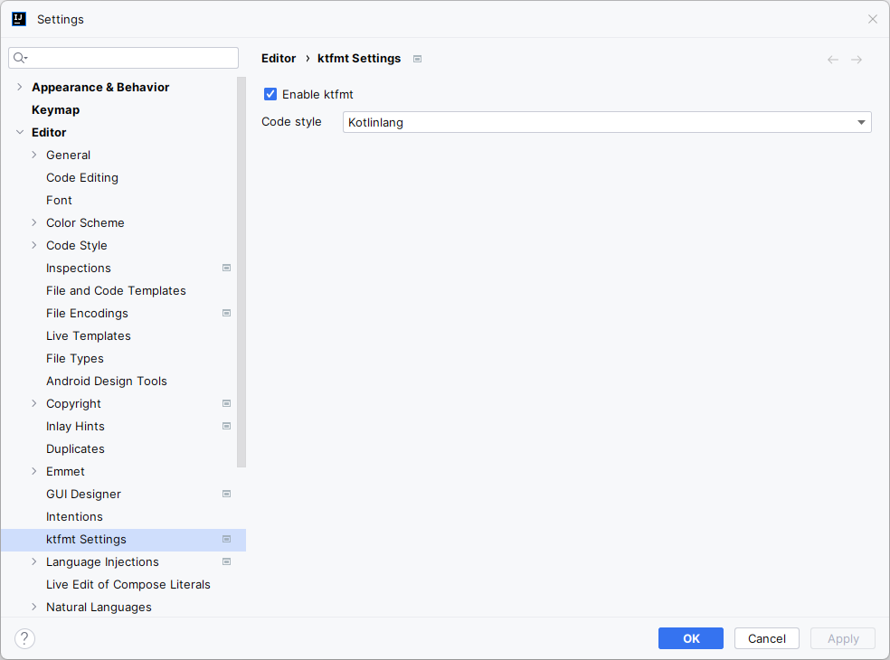
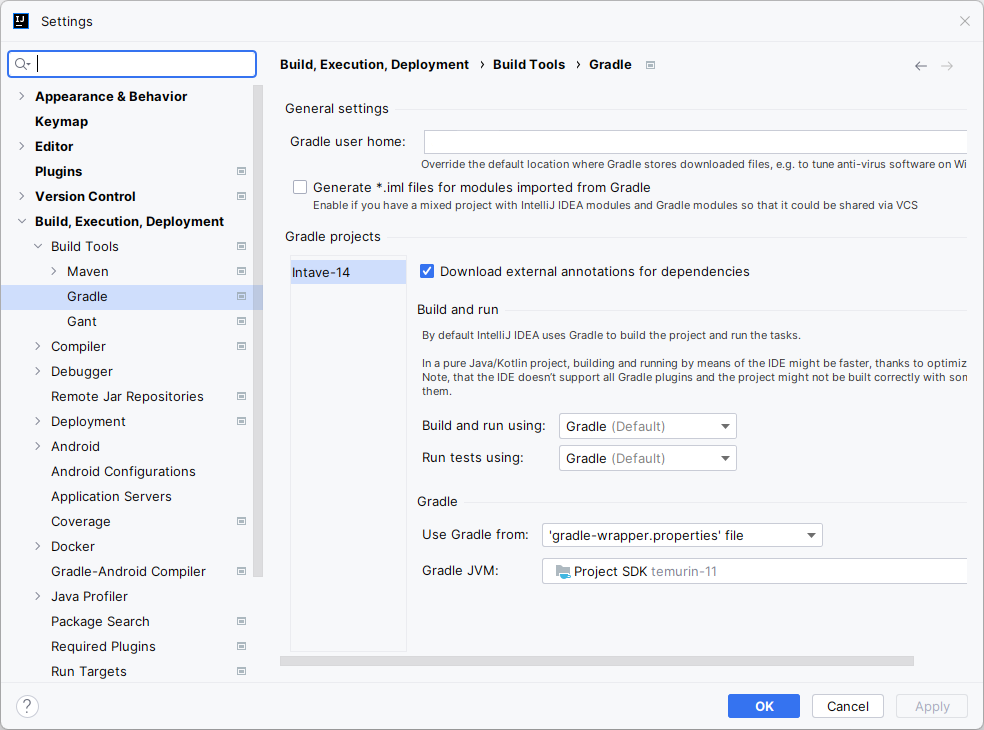

# Intave Anticheat

Intave is a Bukkit anti-cheat plugin; designed to detect flaws, inaccuracies and faults in the
Client-Server communication that seek to give individual players advantages over other players.

## Development

### Project Setup

1. Clone the project: `git clone https://github.com/intave/Intave-14.git`.
2. Open the project as Gradle project; wait a few minutes for IntelliJ to index and build the
   project.
3. For the Kotlin parts of this project (this includes `.kts` files), we
   use [ktmft](https://facebookincubator.github.io/ktfmt/). There is an IntelliJ plugin available.
   Make sure to use the following settings: 

**IMPORTANT:** Intave requires Windows to successfully build! If you are on Linux, you will have to
use Wine to execute the `iacBuild` task.

### Running a Test Instance

#### Gradle managed server (recommended)

Choose one of the `iacServer_X.X.X-jX` gradle tasks, corresponding to the Minecraft server version
you want to test, and execute it. As example, `iacServer_1.8.8-j8` will start a 1.8.8 Paper server.

This approach allows you to run the plugin directly in the IDE. Breakpoints and hotswapping is
enabled!

**IMPORTANT:** In order for hotswapping to work, make sure to have the following build settings:

**WARNING:** Hotswapping not always delivers correct results. Better restart the gradle task
before you're stuck debugging for hours!

#### External server

If you have an external server on your file system, you can simply use the `iacDeploy` task to copy
the built plugin into your `plugins` folder. Make sure to enter the path in the `iacDeploy` task in
the [build.gradle.kts](build.gradle.kts) file first!

For your convenience, you may want to use an auto-reload plugin.
