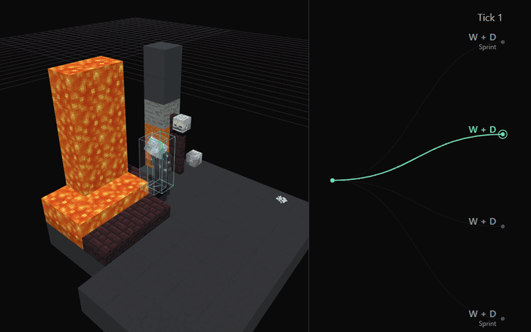
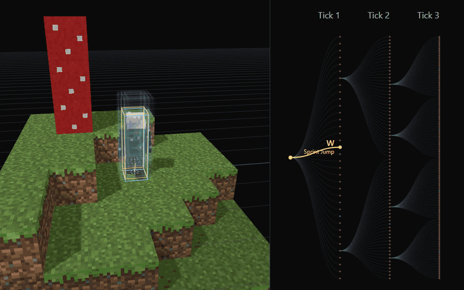

Intave is an enterprise anticheat plugin for Minecraft servers in development since 2016.
After almost a decade of use on the world's largest Minecraft servers, we decided to make
Intave source-available to everyone.

## Downloads
- [Auto Loader](https://github.com/intave/loader/releases/download/1.0.1/IntaveLoader.jar) (Recommended)
- [Nightly Build](https://github.com/intave/intave/releases/download/nightly/Intave.jar)
- [Modrinth](https://modrinth.com/plugin/intave)

## Detection

Intave should be able to detect most of what is currently being used for cheating.
Our detection spectrum is grounded by three large pillars: movement simulation, heuristics, and cloud-based machine learning.

### Movement Simulation

Intave features one of the most advanced movement simulation engines,
with exceptional support for all movement features from 1.8 to 26.2.

Our simulation engine is currently the only one able to simulate multiple ticks between sent and last movement (necessary for 1.9-1.20.2).
This also means the core simulation code comes out of any anticheat closest to the actual Minecraft source-code.

We unit-test the simulation engine on every build end-to-end using pre-recorded movement scenarios.
Every new bug is added, ensuring it never resurfaces again.

### Heuristics

Intave also checks for known cheat patterns, such as unnatural aiming, suspicious block placement,
and automated inventory actions. These checks run directly on your server and catch cheats
that protocol validation alone cannot detect.

### Cloud-based Machine Learning

We offer as a paid service cloud-based machine learning to analyze gameplay samples to detect cheats that are harder to catch with fixed rules,
including killaura, scaffold, and macro cheats.
Cloud detection is optional and requires a paid plan; the other checks work without it.

For more information, see a full list of checks [here](https://docs.intave.ac/mechanics/checks-01-overview.html).

## Development

### Setup

1. Clone the project: `git clone https://github.com/intave/intave.git`.
2. Open the project as Gradle project; wait a few minutes for IntelliJ to index and build the
   project.

### Testing

Choose one of the `intave/run_X.X.X` gradle tasks corresponding to the Minecraft server version
you want to test. Intave is then automatically installed on that server. In case of Intave failing to download
ProtocolLib, make sure you manually install ProtocolLib on the server by moving it into the `plugins` directory.

By doing so, you can run the plugin directly in the IDE. Breakpoints and hotswapping is
enabled!
We use [this IntelliJ plugin](https://plugins.jetbrains.com/plugin/14832-single-hotswap) for efficient hotswapping, which
can swap method contents that don't have an indy lambda or anonymous class.

## Contributing

We accept contributions to the project, but please make sure to read the [contributing guidelines](docs/CONTRIBUTING.md) before doing so.
For a high-level overview of the project organization, see [this document](docs/STRUCTURE.md).
A cheatsheet can be found [here](docs/CHEATSHEET.md) to quickly find your way around the codebase, contributions welcome!
Our block system is briefly outlined in [this document](docs/BLOCK_SYSTEM.md).
If you have any questions, feel free to get in touch with us on [Discord](https://intave.ac/go/discord).

## License
We want to make Intave completely free and open, available for everyone, indefinitely.
However, we don't want you or others to take this work, rebrand it and sell it as their own creation.
We've seen this happen multiple times with other anticheats, and we explicitly forbid this kind of behavior.
Still, we want to allow Minecraft servers commercial use of Intave and
the ability to modify and adapt it to their needs, as long as they don't sell it as a product or publish it.
Therefore, we decided to use the [Polyform Perimeter License 1.0.0](LICENSE.md),
prohibiting any form of competitive use.
We also want to encourage everyone to contribute back to the project instead of creating their personal spin-offs,
making the project better for everyone instead of fragmenting the community and development efforts.
This also technically means Intave isn't actually "open-source", but "source-available" for everyone to use and modify, but not to sell,
rebrand as their own or mix into their own product or project, no matter the respective licenses.
In case of source stealing or commercial redistribution we will be issuing DMCA takedowns and in blatant cases we will go 
the extra mile to bring legal action against you, we are not joking about this.
Please note that Intave uses third-party libraries, which are licensed under their respective licenses and
may not be covered by the Polyform Perimeter License.
