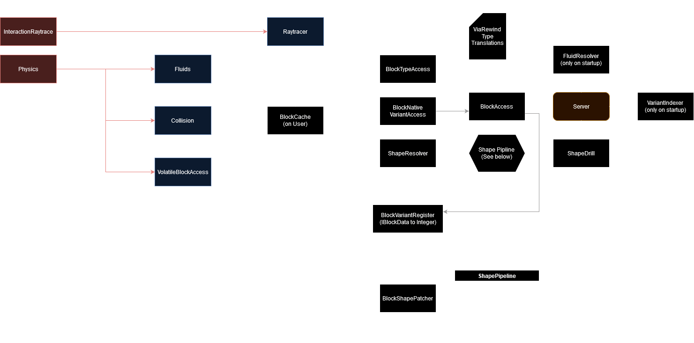

# Intave Block System

## Overview

High level overview of the block system in Intave, leaving out some details but giving a good idea of how the system works.
<br>
<br>
<br>



## Types
Intave uses the Bukkit Material Enum for types.

### Translation

Intave supports type translations, so you can translate blocktypes.
This system is not used in practice :(

## Variants and Variant Indexes
All IBlockDatas from the server are mapped to a **random** and unique variant index.
It is strongly discouraged to use the index directly except when dealing with 1.8 shenanigans.
Variant Index 0 is always the default variant (and is therefore not random).
```java
Material type = ...;
int variantIndex = ...;

// index to MC IBlockData
Object iBlockData = BlockVariantRegister.rawVariantOf(type, variantIndex);
  
// MC IBlockData to index
int variantIndex = BlockVariantRegister.variantIndexOf(type, iBlockData);

// Additionally:

// index to Intave-shaded BlockVariant
BlockVariant variant = BlockVariantRegister.variantOf(type, variantIndex);


```


## Shapes
A blockshape can be
- a cuboid ```CubeShape```
- a ```BoundingBox```, or
- a collection of other blockshapes (```ArrayBlockShape```, ```MergeBlockShape```)

### Origin Shapes
If a shape is an origin shape, it means that it is positioned at x=0 y=0 z=0.
```java
BoundingBox.isOriginShape() // to check if a bounding box is an origin box.
BlockShape.contextualized() // to move the shape to a given poisition.
BlockShape.normalized()     // to move the shape to the origin.
```

### Different use-cases
1. Collision Shape interfere with the player's movement
2. Outline Shape for raytracing
3. Visual Shape for rendering [Not in Intave] (Called "Shape" in the Minecraft source)

### How Patches work
- Called everytime a shape is requested (make the performance not very bad please)
- In the pipeline, patches come after the shape caches, so they are not cached

```java
  @Override             // v---- Only patches outline shape
  protected BlockShape outlinePatch(World world, Player player, int posX, int posY, int posZ, Material type, int variantIndex, BlockShape shape) {
    if (shape.isEmpty()) {                                                                           // ^---------^---------- Always latency synchronous 
      return shape; // <--- No fix when no fix is needed
    }
    BlockVariant variant = BlockVariantRegister.variantOf(type, variantIndex); // <--- Use BlockVariantRegister to access block properties
    boolean hanging = variant.propertyOf("hanging");
    int age = hanging ? variant.propertyOf("age") : 4;
    long randomCoordinate = coordinateRandom(posX, 0, posZ);
    int xOffsetKey = (int) (randomCoordinate & 15L);
    int zOffsetKey = (int) (randomCoordinate >> 8 & 15L);
    BlockShape box = CACHE[age][xOffsetKey][zOffsetKey]; // <--- Local caches speed up the process
    if (box == null) {
      double allowedOffset = 0.25D;
      double offsetX = MathHelper.minmax(-allowedOffset,((double) ((float) xOffsetKey / 15.0F) - 0.5D) * 0.5D, allowedOffset);
      double offsetZ = MathHelper.minmax(-allowedOffset,((double) ((float) zOffsetKey / 15.0F) - 0.5D) * 0.5D, allowedOffset);
      double offsetY = 0.0;
      box = CACHE[age][xOffsetKey][zOffsetKey] = SHAPE_PER_AGE[age].originOffset(offsetX, offsetY, offsetZ);
    }                                                               // ^---- Patches should ideally return an origin shape
    return box;
  }
```
Important: When you use VolatileBlockAccess (or a different means to the block cache) to access a block type, it will potentially also undergo
a shape patch process and might in turn access this shape cache again. Maybe I should add a fix for that...
